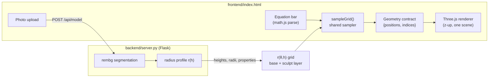

# Vis

**From a photo or an equation to an editable, measurable 3D model — in the browser.**

Vis is a small web app with one renderer and two ways to feed it. Type an equation and it plots the curve or surface. Upload a photo of a rotationally‑symmetric object — a bottle, a vase, a turned table leg — and it segments the object, extracts its silhouette, revolves it into a watertight‑*ish* solid, and lets you **measure it in real units, reshape it, and export a true‑size STL**. Both paths converge on the same geometry contract and the same scene, so there is exactly one rendering pipeline to reason about.

<p>
  
  
  
  
</p>

---

## Table of contents

- [Why Vis](#why-vis)
- [Features](#features)
- [Quick start](#quick-start)
- [Usage](#usage)
- [How it works](#how-it-works)
- [The math](#the-math)
- [API reference](#api-reference)
- [Project structure](#project-structure)
- [Limitations & known issues](#limitations--known-issues)
- [Roadmap](#roadmap)
- [Tech stack](#tech-stack)
- [Contributing](#contributing)
- [License](#license)

---

## Why Vis

Most "photo to 3D" tools need a turntable, a depth sensor, or a dozen images. But a huge class of everyday objects is **rotationally symmetric**, and that symmetry collapses the problem: a single side‑on photo fully determines the 3D shape, because the half‑width of the silhouette at every height *is* the radius at that height. Vis leans on that fact to turn one ordinary photo into a real, editable, measurable model — no rig, no cloud, no GPU.

The equation visualizer shares the same scene because the same machinery — a grid sampler emitting a positions/indices buffer — draws a surface `z = f(x, y)`, a curve `y = f(x)`, and a solid of revolution alike. One contract, three producers.

## Features

- **Equation plotting** — 1‑variable expressions render as 2D curves, 2‑variable as 3D surfaces. Variable detection is automatic; the view switches between an orthographic 2D and a perspective 3D camera and pins to your choice once you click.
- **Photo → 3D** — background removal, largest‑component isolation, radius‑profile extraction, and revolution into an editable mesh.
- **Real‑world scale** — enter one known dimension (the object's height in cm) and every readout becomes physical: diameters in cm, **volume in mL**, and STL export in millimeters at true print size.
- **Measurements** — height, max / base / neck diameter, and volume, recomputed live from the actual mesh.
- **2D profile editor** — drag Catmull‑Rom control points to reshape the symmetric base profile.
- **3D sculpt** — grab the surface and pull a region out or in with a smooth Gaussian falloff. This breaks symmetry: the model is stored as a full radius field `r(θ, h)`, not a 1D profile.
- **Layered, non‑destructive editing** — the symmetric base profile and the asymmetric sculpt offsets live on separate layers, so 2D edits and 3D sculpts compose instead of overwriting each other.
- **STL export** — binary STL, in millimeters when calibrated.
- **Math overlays** — labeled axes with tick numbers and intercept markers (roots, axis crossings) for the equation mode.

## Quick start

> First success in under five minutes. No GPU required; everything runs on CPU.

**Prerequisites:** Python 3.11+ and a modern browser. (Internet access on first run: the segmentation model and the front‑end libraries are fetched once and cached.)

```bash
# 1. Clone
git clone https://github.com/Niranjan-J1/Vis-.git
cd Vis-

# 2. Create an isolated environment
python -m venv .venv
# Windows:  .\.venv\Scripts\Activate.ps1
# macOS/Linux:  source .venv/bin/activate

# 3. Install dependencies
pip install flask numpy scipy opencv-python Pillow scikit-image "rembg[cpu]"

# 4. Run
python backend/server.py
```

Then open **http://localhost:8000/**. Press <kbd>Enter</kbd> on the default equation to see a surface, or click the upload icon in the command bar and pick a photo of a symmetric object.

> The front end must be served over HTTP (it fetches the API and loads ES modules), which is exactly what `server.py` does — opening `index.html` from disk with `file://` will not work.

## Usage

**Plot an equation.** Type into the command bar and press <kbd>Enter</kbd>:
- `sin(x) * cos(x)` → a 2D curve (orthographic view).
- `sin(sqrt(x^2 + y^2) * 3) * 0.6` → a 3D surface (perspective view).

**Model a photo.** Click the upload icon. Shoot the object straight‑on against a contrasting background for best results. After a moment the model appears and the inspector opens on the right.

**Calibrate.** In **Scale**, type the object's real height in centimeters. Measurements switch from pixels to cm and mL instantly and stay correct as you edit.

**Reshape.**
- *2D profile editor* — drag the yellow control points to adjust the symmetric silhouette.
- *Sculpt* — toggle **Sculpt**, then drag on the surface to pull a region in or out. Orbit pauses while sculpting; toggle it off to look around. Sculpt and the 2D editor are independent layers, so neither erases the other. **Reset** returns to the original.

**Export.** Click **Export STL**. If you've calibrated, the file is in millimeters and prints at true size.

## How it works




**One geometry contract.** Every producer emits `{ positions: Float32Array, indices: Uint32Array }`, consumed by a single renderer. A shared `sampleGrid(fn, uRange, vRange, uRes, vRes)` walks a parameter grid and triangulates it; the only thing that changes is the function:
- surface → `(x, y) ⇒ [x, y, f(x,y)]`
- curve → `x ⇒ [x, f(x), 0]` (drawn as a line)
- revolution → `(θ, h) ⇒ [r·cosθ, r·sinθ, h]`

**The photo pipeline** (server side, in `photo_to_profile`):
1. **Segment** — `rembg` with the `isnet-general-use` model produces an alpha mask.
2. **Isolate** — binarize, keep the largest connected component, fill interior holes.
3. **Profile** — for each image row, the object's half‑width is the radius at that height, giving `r(h)`.
4. **Clean** — a median filter removes speckle, a Savitzky–Golay filter smooths while preserving shape, and the profile is resampled to a fixed length.
5. **Return** — `heights`, `radii`, and pixel‑space `properties` as JSON.

**The model representation.** The browser does *not* keep the profile as a 1D curve. It builds a radius field `r(θ, h)` on a grid (96 angles × 140 heights), composed of two layers:

```
Rgrid[θ][h] = max(0, base(h) + offset[θ][h])
```

- `base(h)` — the full‑resolution symmetric profile plus a smooth delta from the 2D editor's control points.
- `offset[θ][h]` — asymmetric deviations written by the 3D sculpt brush.

Because the two layers are independent, editing the profile and sculpting the surface never clobber each other. Revolution, measurement, and export all read from the composed grid.

**Coordinate convention.** Z‑up. The floor is the x–y plane (the grid is rotated to match), vertical is z, and the camera's up vector is `(0, 0, 1)`. Axis lines run through the origin into the negatives in red/green/blue.

## The math

**Solid of revolution.** A side‑on circle projects to its diameter, so the silhouette's half‑width at height `h` is exactly the radius `r(h)`. Revolving that profile reconstructs the surface, and one photo suffices because symmetry maps the 1D profile to the full 3D shape.

**Volume.** For a classic axisymmetric solid, the disk method gives

$$V = \int \pi\, r(h)^2 \, dh$$

Vis stores an asymmetric field `r(θ, h)`, so it uses the generalized form. The area of a cross‑section is the polar‑area integral, and volume integrates that over height:

$$A(h) = \frac{1}{2}\int_0^{2\pi} r(\theta, h)^2 \, d\theta
\qquad
V = \frac{1}{2}\iint r(\theta, h)^2 \, d\theta\, dh$$

When `r` is independent of `θ`, the inner integral collapses to `½·2π·r² = πr²` and this reduces exactly to the disk formula — so it's a true generalization, and the volume stays correct after you sculpt a bulge.

**Calibration.** With a known height `H_cm` spanning `H_px` pixels,

$$\text{mm per px} = \frac{10\,H_{cm}}{H_{px}}$$

Lengths multiply by this factor; volume multiplies by its cube, and `mm³ ÷ 1000 = mL`. Calibrating off height assumes a near‑orthographic, straight‑on shot — accurate to a few percent in practice.

## API reference

The Flask server serves the front end statically and exposes one endpoint.

### `POST /api/model`

Convert a photo into a radius profile and measurements.

**Request** — `multipart/form-data`

| Field   | Type | Description                          |
|---------|------|--------------------------------------|
| `image` | file | Photo of a rotationally‑symmetric object |

**Response** — `200 application/json` (all values in **pixels**)

```json
{
  "heights": [0.0, 1.0, 2.0, "…"],
  "radii":   [12.4, 12.6, 13.1, "…"],
  "properties": {
    "height":       742,
    "maxDiameter":  210,
    "baseDiameter": 188,
    "neckDiameter":  96,
    "volume":       18400000
  }
}
```

`heights` and `radii` are equal‑length arrays describing the profile; the client resamples and revolves them. Calibration to physical units happens entirely client‑side.

```bash
curl -F "image=@bottle.jpg" http://localhost:8000/api/model
```

## Project structure

```
Vis/
├── backend/
│   ├── server.py        # Flask app: static serving + POST /api/model
│   ├── segment.py       # dev script: segmentation stage, for visual debugging
│   ├── profile.py       # dev script: profile-extraction stage
│   └── revolve.py       # dev script: revolution stage
├── frontend/
│   └── index.html       # the entire app: HTML + CSS + Three.js/math.js (ES modules via CDN)
├── learn/               # optional parallel ML-learning track (uses torch; not needed to run Vis)
│   ├── 01_image_as_tensor.py
│   └── 02_learnable_convolution.py
└── README.md
```

The `backend/segment.py`, `profile.py`, and `revolve.py` scripts mirror the stages now folded into `server.py`; keep them for inspecting any single stage in isolation.

## Limitations & known issues

- **Star‑shaped only.** The `r(θ, h)` representation can model bulges and dents but not overhangs, handles, or spouts — anywhere a ray from the central axis would cross the surface twice. True free‑form geometry needs a general mesh (and volume via signed tetrahedra).
- **Open end caps.** Exported meshes are closed around the seam but currently open at the top and bottom, so the STL is a surface, not a sealed solid. Cap the ends before slicing for print. *(On the roadmap.)*
- **Calibration assumes a straight‑on shot.** Perspective foreshortening introduces error; shoot orthographic‑ish for best accuracy.
- **Segmentation depends on contrast.** Cluttered or low‑contrast backgrounds degrade the mask. A click‑to‑select segmentation mode is planned.
- **First run downloads a model.** `rembg` fetches `isnet-general-use` on first use; it's cached afterward.

## Roadmap

- [ ] Watertight export — fan‑triangulate top and bottom end caps.
- [ ] OBJ export alongside STL.
- [ ] Sculpt controls — adjustable brush size and explicit push/pull.
- [ ] Robust segmentation — SAM‑style click‑to‑select for hard photos.
- [ ] Function‑defined solids — type `r = f(h)` and revolve it (reuses `sampleGrid`).
- [ ] Hollowing / wall thickness for printable vessels.

## Tech stack

**Front end** — single HTML file, no build step. [Three.js](https://threejs.org/) r160 for rendering, [math.js](https://mathjs.org/) 13 for parsing and evaluation, both loaded as ES modules from a CDN import map.

**Back end** — [Flask](https://flask.palletsprojects.com/) with [rembg](https://github.com/danielgatis/rembg) (ISNet) for segmentation, plus NumPy, SciPy, OpenCV, scikit‑image, and Pillow for profile extraction.

## Contributing

Issues and pull requests are welcome. To work on the project:

1. Fork and clone, then follow [Quick start](#quick-start).
2. Keep the architecture invariants intact: the `{positions, indices}` geometry contract, the shared `sampleGrid` sampler, the z‑up convention, and the `POST /api/model` response shape. New input sources should *produce* geometry for the existing renderer, not add a parallel renderer.
3. Open a PR describing the change and how you verified it.

## License

MIT — add a `LICENSE` file at the repository root before publishing.

---

<sub>Built as a learning vehicle and a genuinely useful tool: photograph a symmetric object, get its real‑world dimensions and capacity, reshape it, and print it.</sub>
